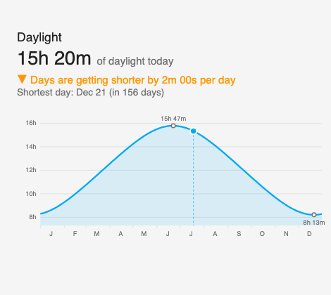

# Sunlight Curve Card



A custom Lovelace card for Home Assistant that shows **day length across the
whole year** as a sine-like curve, with a marker for today. At a glance you can
see:

- How much daylight you get today (e.g. `15h 42m`)
- Whether days are **getting longer or shorter**, and by how much per day
- When the next longest/shortest day of the year is
- Where "today" sits on the annual curve, with month labels and the
  solstice extremes marked
- Hover (or tap) anywhere on the curve to see the daylight for any other
  date of the year

Everything is computed client-side from your latitude (taken automatically from
your Home Assistant home location), so the card needs **no sensors, no
integrations, and no internet access**. Works in both hemispheres and at polar
latitudes.

## Installation

### HACS (recommended)

1. HACS → three-dot menu → **Custom repositories**
2. Add this repository URL with type **Dashboard**
3. Install **Sunlight Curve Card**

### Manual

1. Copy `sunlight-curve-card.js` into your Home Assistant `config/www/` folder
2. Go to **Settings → Dashboards → three-dot menu → Resources → Add resource**
   - URL: `/local/sunlight-curve-card.js`
   - Type: **JavaScript module**
3. Refresh your browser

## Usage

Add the card from the dashboard card picker (search "Sunlight"), or in YAML:

```yaml
type: custom:sunlight-curve-card
title: Daylight
```

### Options

| Name | Type | Default | Description |
| --- | --- | --- | --- |
| `title` | string | `Daylight` | Card title. Set to `""` to hide. |
| `latitude` | number | HA home latitude | Override the latitude used for the curve. |
| `show_trend` | boolean | `true` | Show the "getting longer/shorter by X per day" line. |
| `show_extremes` | boolean | `true` | Mark the longest and shortest days on the curve. |
| `line_color` | string | theme primary color | Any CSS color for the curve. |

All options are also editable in the visual card editor.

## How it works

Day length is calculated with the standard sunrise equation from solar
declination and latitude — the same astronomy that produces the familiar
seasonal sine wave. Values are sunrise-to-sunset (geometric, without
atmospheric refraction), accurate to within a couple of minutes, which is
plenty for watching the seasons swing.
